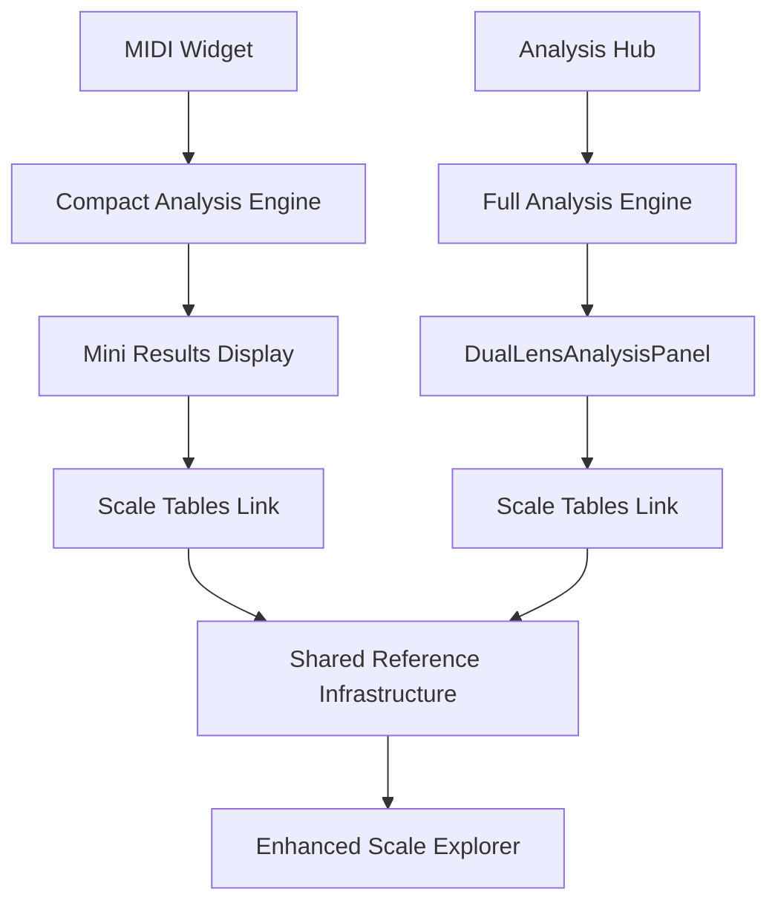
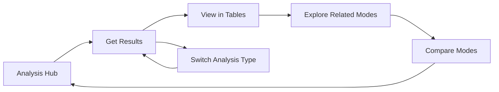

# UI Consolidation Framework
## Music Theory Toolkit Application Restructuring Plan

**Date**: January 2025
**Status**: Approved for Implementation
**Phase**: Design & Planning Complete

## Executive Summary

This document outlines the comprehensive UI/UX restructuring plan to consolidate and streamline the Music Theory Toolkit application. The goal is to transform from a fragmented multi-tab interface to a cohesive, pedagogically-sound analysis engine that guides users from simple to complex theoretical concepts.

**Key Objectives**:
- Reduce tabs from 4 to 3 (25% reduction)
- Eliminate AI-only dependencies in favor of logic-first approach with AI enhancement
- Create seamless cross-feature navigation
- Establish unified analysis pipeline
- Improve pedagogical flow
- Implement unified music input system across all components
- Design MIDI real-time detection as standalone widget for future Chrome plugin
- Create shared scale tables infrastructure serving both main app and widget

## Current State Analysis

### Existing Tab Structure
1. **Mode Identification Tab**: Melody/scale/chord progression analysis
2. **Mode Discovery Tab**: Build modes from root notes *(75% incomplete)*
3. **Enhanced Harmony Tab**: Comprehensive analysis engine
4. **Reference Tab**: Scale tables with MIDI integration

### Critical Issues Identified
- **Analysis Fragmentation**: Multiple competing analysis systems
- **Tab Redundancy**: Mode Identification and Enhanced Harmony analyze same inputs
- **Incomplete Features**: Discovery tab only 25% implemented
- **AI Dependencies**: Legacy ChordAnalyzer conflicts with comprehensive system
- **Inconsistent UX**: Different loading states, form patterns, result displays
- **Input Inconsistency**: Different input methods across components (MIDI, mouse, keyboard)
- **Widget Architecture Gap**: MIDI detection needs independent analysis capabilities for plugin future

## Consolidation Strategy

### Phase 1: Tab Structure Consolidation

#### New 3-Tab Architecture

```
📊 Analysis Hub
├── Unified Music Input System:
│   ├── 🎹 MIDI Input (chord recognition)
│   ├── 🖱️ Mouse Input (visual chord/symbol layout)
│   └── ⌨️ Keyboard Input (text-based)
├── Analysis Types:
│   ├── 🎼 Melody Analysis
│   ├── 🎵 Scale Analysis
│   ├── 🎶 Chord Progression Analysis
│   └── 🎤 Audio Analysis (future)
└── Results: Unified comprehensive analysis

📚 Explore & Reference
├── Shared Scale Tables & Reference Infrastructure
├── Mode Builder (from Discovery)
├── Comparative Analysis Tools
└── Links from both Analysis Hub and MIDI Widget

🔧 Analysis Widget
├── MIDI Real-time Detection Widget
│   ├── Compact Comprehensive Analysis
│   ├── Links to Scale Tables
│   └── Chrome Plugin Architecture
├── MIDI Configuration
├── Analysis Preferences
└── Debug Tools (optional)
```

#### Changes Explained

**CONSOLIDATE**: Mode Identification + Enhanced Harmony → Analysis Hub
- **Reasoning**: Both analyze musical input with overlapping functionality
- **Benefit**: Single entry point reduces user confusion
- **Technical**: Unified input routing to Comprehensive Analysis Engine

**REMOVE**: Mode Discovery Tab
- **Reasoning**: Only 25% functional (3 of 4 methods "Coming Soon")
- **Migration**: Move "Build from Root" to Reference as exploration tool
- **Impact**: No user-facing functionality lost

**ENHANCE**: Reference → Explore & Reference
- **Reasoning**: Become comprehensive exploration hub
- **Additions**: Mode builder, comparison tools, enhanced interactivity
- **Shared Infrastructure**: Serves both main Analysis Hub and MIDI Widget
- **Cross-Navigation**: Seamless links from analysis results and widget

**RESTRUCTURE**: Settings → MIDI Widget & Tools
- **Reasoning**: MIDI real-time detection is a standalone widget, not just a reference tool
- **Widget Architecture**: Compact version of comprehensive analysis for future Chrome plugin
- **Independent Analysis**: Mini-version of comprehensive analysis capabilities
- **Plugin Preparation**: Designed as modular component for browser extension

### Phase 2: Unified Music Input System

#### Universal Input Architecture
```
┌─────────────────────────────────────────────────────────────┐
│                 Unified Music Input System                  │
├─────────────────┬─────────────────┬─────────────────────────┤
│   MIDI Input    │   Mouse Input   │    Keyboard Input       │
│  (Real-time)    │   (Visual)      │   (Text-based)          │
├─────────────────┼─────────────────┼─────────────────────────┤
│ • Chord recog   │ • Chord layout  │ • Roman numerals        │
│ • Note detection│ • Inversions    │ • Chord symbols         │
│ • Timing aware  │ • Quick select  │ • Scale names           │
└─────────────────┴─────────────────┴─────────────────────────┘
                             │
                             ▼
                 Comprehensive Analysis Engine
                             │
                             ▼
                    DualLensAnalysisPanel
```

**Implementation Across Components**:
- **Analysis Hub**: Full unified input system for all analysis types
- **MIDI Widget**: Focused on MIDI input with compact mouse/keyboard fallbacks
- **Future Components**: Consistent input patterns across entire app

**Technical Benefits**:
- Single input validation system
- Consistent user experience
- Reduced learning curve
- Unified testing strategy

### Phase 3: MIDI Widget Architecture

#### Standalone Widget Design


**Widget Characteristics**:
- **Independent Analysis**: Self-contained comprehensive analysis capabilities
- **Compact UI**: Optimized for minimal screen real estate
- **Plugin Ready**: Modular architecture for Chrome extension extraction
- **Shared Resources**: Links to common scale tables infrastructure
- **Real-time Focus**: Optimized for live MIDI input and immediate feedback

**Chrome Plugin Preparation**:
- Minimal dependencies on main app state
- Self-contained analysis logic
- Lightweight UI components
- Direct scale table integration

### Phase 4: Cross-Feature Navigation Framework

#### Unified Analysis Context System


**Navigation Principles**:
- **Context Preservation**: Analysis results flow through centralized state
- **Smart Suggestions**: Results automatically suggest next actions
- **Seamless Transitions**: Natural progression from analysis to exploration
- **Return Paths**: Clear way back to input/analysis from any point

## Implementation Roadmap

### Week 1: Foundation
**Days 1-2: Unified Music Input System**
- [ ] Design and implement universal input component architecture
- [ ] Create MIDI input handler with chord recognition
- [ ] Build visual mouse input interface with chord layouts and inversions
- [ ] Enhance keyboard input with better parsing and validation
- [ ] Test input consistency across all analysis types

**Days 3-4: Analysis Hub Creation**
- [ ] Combine ModeIdentificationTab + EnhancedHarmonyTab with unified input
- [ ] Create unified input routing system
- [ ] Test all analysis types → DualLensAnalysisPanel flow
- [ ] Implement consistent loading states

**Day 5: Shared Scale Tables Infrastructure**
- [ ] Extract scale tables into shared service layer
- [ ] Design cross-navigation patterns between analysis and reference
- [ ] Prepare scale tables to serve both main app and widget

### Week 2: Widget Architecture & Integration
**Days 1-3: MIDI Widget Development**
- [ ] Extract MIDI real-time detection into standalone widget
- [ ] Implement compact comprehensive analysis for widget
- [ ] Create mini results display optimized for widget constraints
- [ ] Integrate widget with shared scale tables infrastructure
- [ ] Prepare modular architecture for future Chrome plugin extraction

**Days 4-5: Legacy Removal & Polish**
- [ ] Remove ModeIdentificationTab.tsx
- [ ] Remove ModeDiscoveryTab.tsx
- [ ] Remove ChordAnalyzer.tsx
- [ ] Remove UnifiedResultsPanel.tsx
- [ ] Update navigation to 3-tab structure (Analysis Hub, Explore & Reference, MIDI Widget & Tools)
- [ ] Clean up unused service methods
- [ ] Standardize input validation patterns across unified system
- [ ] Comprehensive testing of all input methods and cross-navigation flows

## Technical Implementation Details

### Component Changes

#### New Components
- `AnalysisHub.tsx` - Unified input and analysis interface
- `UnifiedMusicInput.tsx` - Universal input component (MIDI/Mouse/Keyboard)
- `MidiWidget.tsx` - Standalone widget with compact analysis
- `ExploreAndReference.tsx` - Enhanced reference with builder tools
- `SharedScaleTables.tsx` - Common infrastructure for main app and widget
- `UnifiedAnalysisContext.tsx` - Centralized state management
- `CompactAnalysisEngine.tsx` - Lightweight analysis for widget use

#### Modified Components
- `QuestionDrivenMusicTool.tsx` - Updated tab structure
- `DualLensAnalysisPanel.tsx` - Enhanced cross-navigation
- Navigation components - Reduced from 4 to 3 tabs

#### Removed Components
- `ModeIdentificationTab.tsx`
- `ModeDiscoveryTab.tsx`
- `ChordAnalyzer.tsx`
- `UnifiedResultsPanel.tsx`

### Service Layer Changes

#### Unified Analysis Pipeline
```typescript
// Before: Multiple entry points and inconsistent inputs
ModeIdentificationTab → geminiService (keyboard only)
EnhancedHarmonyTab → comprehensiveAnalysisService (keyboard only)
ChordAnalyzer → geminiService (keyboard only)
MIDI Detection → realTimeModeDetection (MIDI only)

// After: Unified input system with dual analysis paths
UnifiedMusicInput → {
  Analysis Hub → comprehensiveAnalysisService → DualLensAnalysisPanel
  MIDI Widget → compactAnalysisEngine → MiniResultsDisplay
}

// Input method support across all components
interface UnifiedInput {
  midi: MidiChordRecognition;
  mouse: VisualChordSelector;
  keyboard: TextInputParser;
}
```

### State Management

#### Centralized Analysis Context
```typescript
interface UnifiedAnalysisContext {
  currentAnalysis: ComprehensiveAnalysisResult | null;
  analysisHistory: AnalysisRecord[];
  navigationState: NavigationContext;
  crossFeatureActions: ActionSuggestion[];
  sharedScaleTables: ScaleTableState;
  widgetState: MidiWidgetState;
  inputMethod: 'midi' | 'mouse' | 'keyboard';
}

interface MidiWidgetState {
  compactAnalysis: CompactAnalysisResult | null;
  isActive: boolean;
  pluginMode: boolean;
  scaleTableLinks: ScaleReference[];
}

interface SharedScaleTableState {
  currentScale: Scale | null;
  referenceSource: 'analysis' | 'widget' | 'direct';
  navigationHistory: ScaleNavigationRecord[];
}
```

## User Experience Benefits

### Simplified Learning Path
1. **Single Entry Point**: Analysis Hub eliminates "where do I start?" confusion
2. **Comprehensive Results**: See functional, modal, and chromatic perspectives together
3. **Natural Progression**: Analysis → Reference → Exploration → Comparison
4. **Progressive Disclosure**: Advanced features available but not overwhelming

### Reduced Cognitive Load
- **3 tabs vs 4**: 25% reduction in navigation complexity
- **Consistent Patterns**: Same input/output flow across all analysis types
- **Clear Hierarchy**: Analysis first, exploration second, settings third

### Enhanced Pedagogical Value
- **Context-Aware Navigation**: Results suggest related concepts to explore
- **Comparative Analysis**: Easy to see relationships between analytical approaches
- **Skill Building**: Natural progression from basic to advanced concepts
- **Input Method Flexibility**: Learn through preferred interaction style (MIDI, visual, or text)
- **Widget Learning**: Compact analysis encourages exploration and experimentation
- **Cross-Platform Preparation**: Widget architecture enables learning anywhere (future Chrome plugin)

## Success Metrics

### Quantitative Goals
- **Reduce time-to-first-analysis** by 40%
- **Decrease code complexity** by 30%
- **Increase feature discovery** by 50%
- **Reduce support questions** about navigation by 60%

### Qualitative Improvements
- Clearer user mental model of app capabilities
- More intuitive progression through complexity levels
- Better integration between analysis and exploration
- Stronger pedagogical flow

## Risk Mitigation

### User Adoption Risks
- **Mitigation**: Gradual rollout with feature flagging
- **Fallback**: Maintain old tabs during transition period
- **Communication**: Clear migration guide for existing users

### Technical Risks
- **Mitigation**: Comprehensive testing at each phase
- **Rollback Plan**: Git branching strategy for easy reversion
- **Monitoring**: User analytics to track adoption and issues

## Post-Implementation

### Maintenance Benefits
- **Fewer Components**: Reduced surface area for bugs
- **Unified Testing**: Single analysis pipeline to test
- **Clearer Architecture**: Obvious place for new features
- **Better Performance**: Eliminated redundant analysis calls

### Future Enhancement Opportunities
- **Audio Analysis Integration**: Natural fit in unified input system
- **Advanced Comparison Tools**: Build on shared scale tables infrastructure
- **Collaborative Features**: Share analysis results naturally
- **Educational Pathways**: Guided learning sequences
- **Chrome Plugin Launch**: Extract MIDI widget as standalone browser extension
- **Advanced Input Methods**: Voice input, gesture recognition
- **Multi-Platform Widgets**: Desktop, mobile, and web widget ecosystem
- **Real-time Collaboration**: Shared analysis sessions with unified input

---

**Next Steps**:
1. Stakeholder approval of this framework
2. Begin Week 1 implementation
3. Create detailed technical specifications for each component
4. Set up feature flags for gradual rollout

**Document Owner**: UI Design Team
**Implementation Team**: Frontend Development
**Timeline**: 2 weeks active development + 1 week testing/polish
