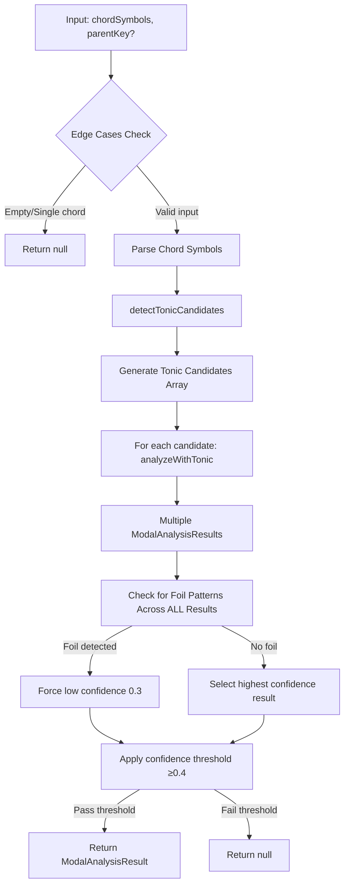
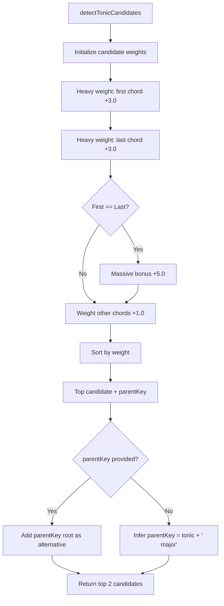
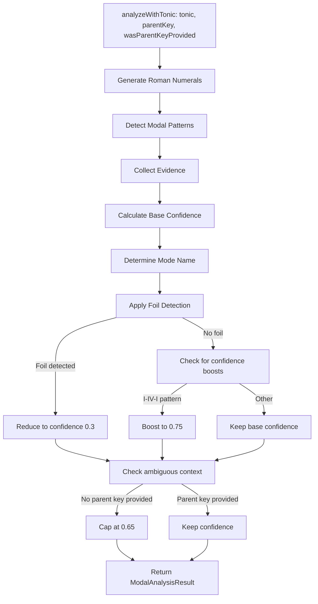
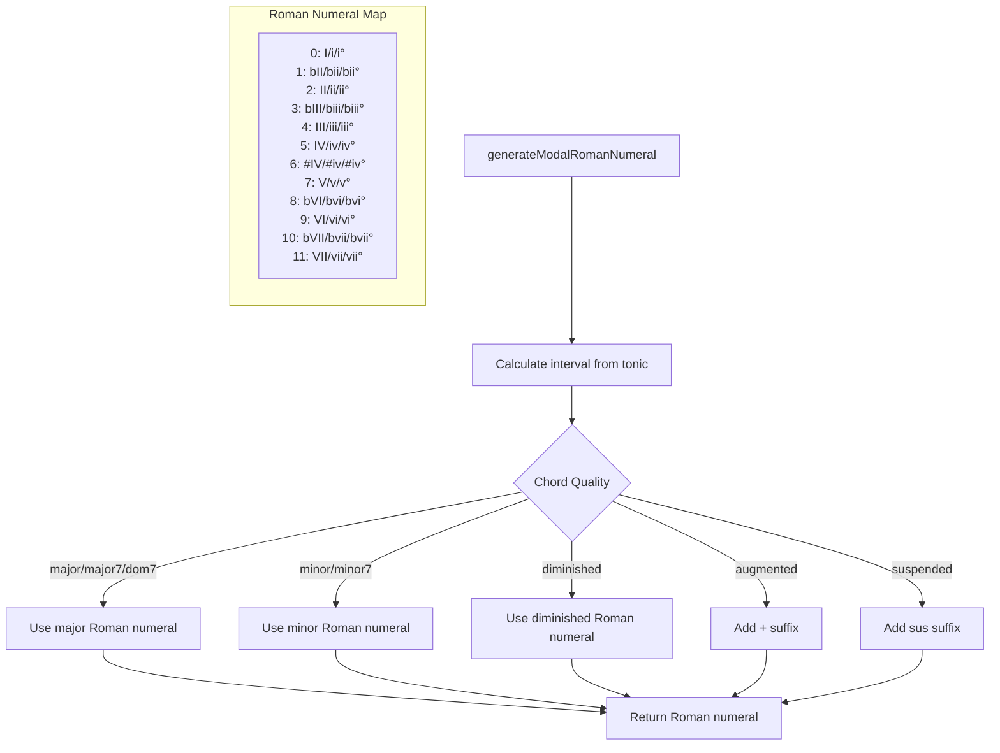
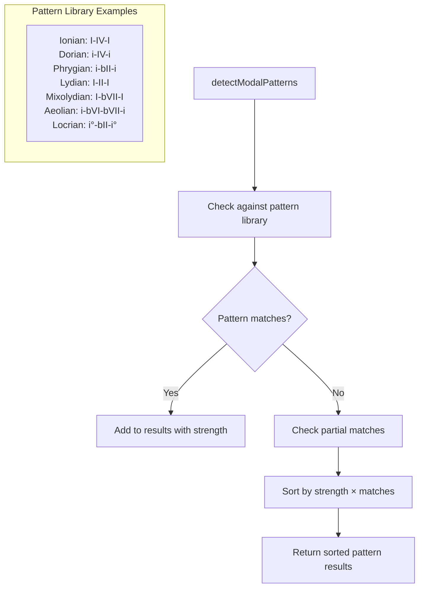
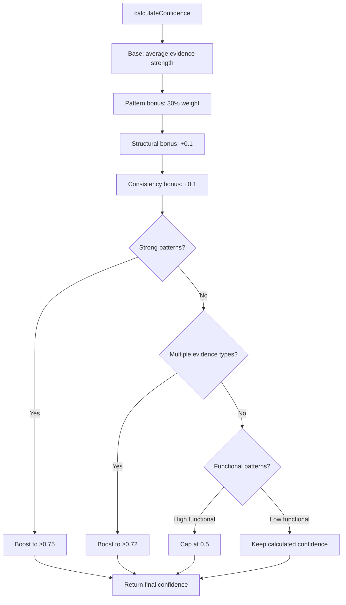
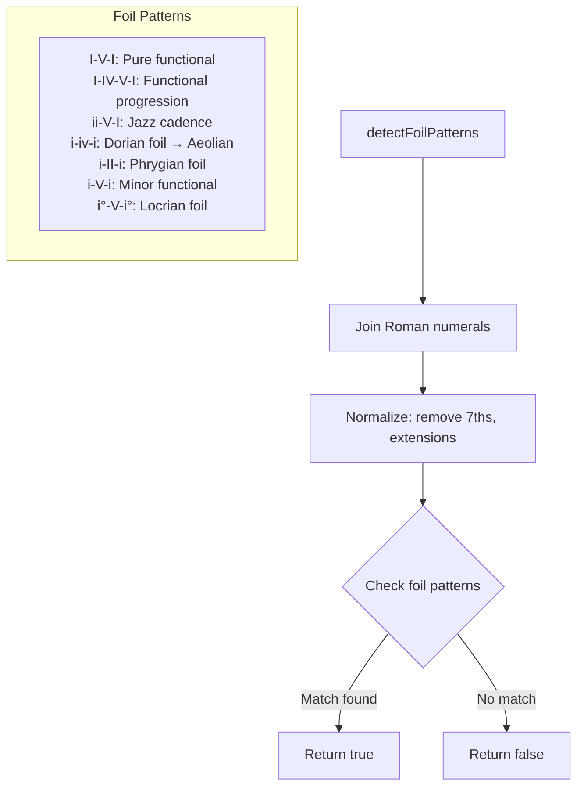
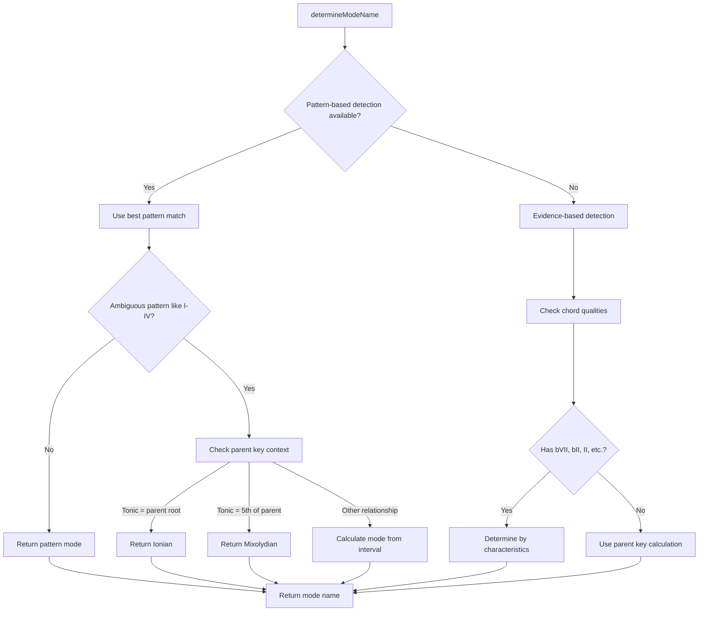

# Enhanced Modal Analyzer Flow Diagram

## Overview
The Enhanced Modal Analyzer uses a multi-stage analysis approach with confidence-based scoring to identify modal characteristics in chord progressions.

## Main Flow: `analyzeModalCharacteristics(chordSymbols, parentKey?)`



## Stage 1: Tonic Candidate Detection



## Stage 2: Individual Tonic Analysis (`analyzeWithTonic`)



## Stage 3: Roman Numeral Generation



## Stage 4: Modal Pattern Detection



## Stage 5: Confidence Calculation



## Stage 6: Foil Pattern Detection



## Stage 7: Mode Name Determination



## Key Design Principles

### 1. Multi-Candidate Analysis
- Generates multiple tonic candidates based on structural importance
- Analyzes each candidate independently
- Selects best result based on confidence

### 2. Evidence-Based Scoring
- Structural evidence (chord positions, repetition)
- Pattern evidence (known modal progressions)
- Contextual evidence (parent key relationships)
- Intervallic evidence (characteristic modal intervals)

### 3. Foil Detection Override
- Cross-candidate foil detection prevents wrong tonic selection
- Functional patterns (I-V-I, ii-V-I) flagged as non-modal
- Dorian foils (i-iv-i) and Phrygian foils (i-II-i) detected

### 4. Confidence Thresholds
- Minimum 0.4 confidence for detection
- Lower 0.25 threshold for vamp patterns (2 chords)
- Ambiguous patterns (no parent key) capped at 0.65
- Foil patterns forced to 0.3

### 5. Parent Key Context
- Explicit parent keys provide harmonic context
- Missing parent keys indicate ambiguous analysis
- Inferred parent keys (`tonic + ' major'`) treated as ambiguous

## Critical Fix: Foil Pattern Override

The major breakthrough was adding cross-candidate foil detection:

```typescript
// Check for foil patterns across ALL candidates before selection
const foilResults = validResults.filter(result => {
  if (!result.romanNumerals) return false;
  return this.detectFoilPatterns(result.romanNumerals);
});

// If ANY candidate is detected as foil, override with low confidence
if (foilResults.length > 0) {
  const foilResult = foilResults[0];
  foilResult.confidence = 0.3;
  return foilResult.confidence >= 0.4 ? foilResult : null;
}
```

This ensures that foil patterns are consistently detected regardless of which tonic candidate analysis generates them, preventing high-confidence wrong results from being selected.